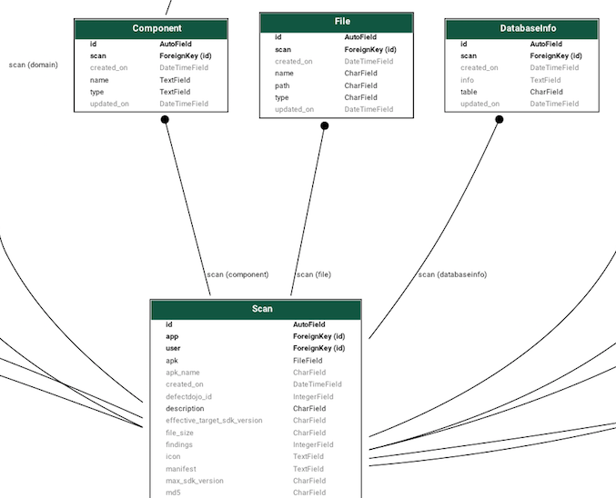
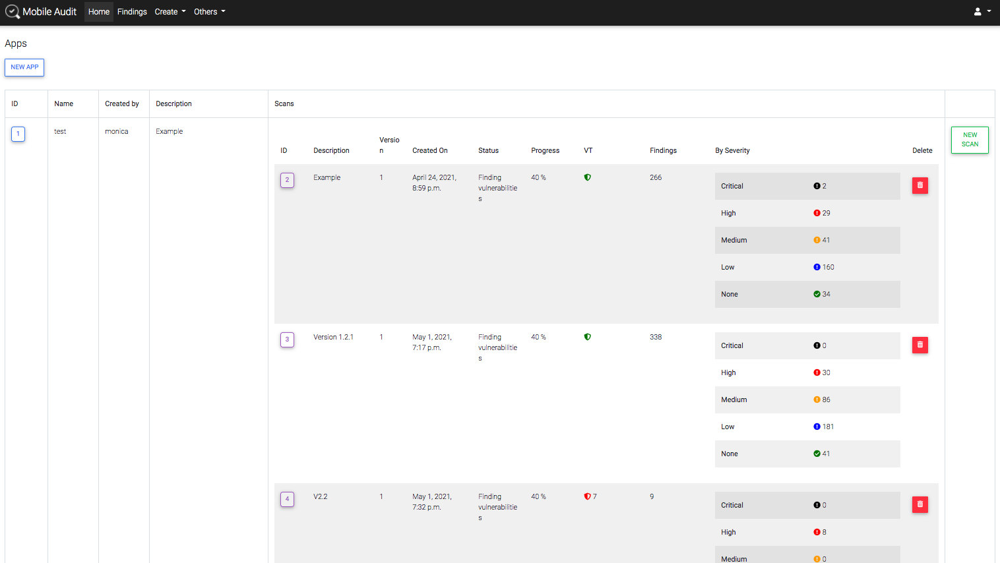

## Mobile Audit


**MobileAudit** - SAST and Malware Analysis for Android Mobile APKs

- [Mobile Audit](#mobile-audit)
  - [Components](#components)
  - [Docker Base images](#docker-base-images)
  - [Main features](#main-features)
  - [Patterns](#patterns)
  - [Models](#models)
    - [Virus Total (API v3)](#virus-total-api-v3)
    - [Defect Dojo (API v2)](#defect-dojo-api-v2)
    - [MalwareDB \& Maltrail](#malwaredb--maltrail)
  - [Installation](#installation)
  - [API v1](#api-v1)
    - [Usage](#usage)
    - [Swagger](#swagger)
    - [ReDoc](#redoc)
    - [Endpoints](#endpoints)
  - [TLS](#tls)
    - [Pre-requirements](#pre-requirements)
    - [Nginx configuration](#nginx-configuration)
    - [Docker configuration](#docker-configuration)
  - [Environment variables](#environment-variables)
---------------------------------------

Django Web application for performing Static Analysis and detecting malware in Android APKs


In each of the scans, it would have the following information:

* Application Info
* Security Info
* Components
* SAST Findings
* Best Practices Implemented
* Virus Total Info
* Certificate Info
* Strings
* Databases
* Files


For easy access there is a sidebar on the left page of the scan:


### Components


- **db**: PostgreSQL 3.11.5
- **nginx**: Nginx 1.23.3
- **rabbitmq**: RabbitMQ 3.11.5
- **worker**: Celery 5.2.2
- **web**: Mobile Audit App (Django 3.2.16)

### Docker Base images

Image is based on python buster. Link to [Docker Hub image](https://hub.docker.com/repository/docker/mpast/mobile_audit)

| Image |  Tags | Base |
|--------------------|-------|--------------------- |
| mpast/mobile_audit | 3.0.0 | python:3.9.16-buster |
| mpast/mobile_audit | 2.2.1 | python:3.9.7-buster  |
| mpast/mobile_audit | 1.3.8 | python:3.9.4-buster  |
| mpast/mobile_audit | 1.0.0 | python:3.9.0-buster  |

### Main features

- [x] Uses Docker for easy deployment in multiplatform environment
- [x] Extract all information of the APK
- [x] Analyze all the source code searching for weaknesses
- [x] All findings are categorized and follows **CWE standards**
- [x] All findings are categorized and include **Mobile Top 10 Risk**
- [x] Also highlight the **Best Practices in Secure Android Implementation** in the APK
- [x] The findings can be edited and the **false positives can be triaged and deleted**
- [x] All scan results can be **exported to PDF**
- [x] User authentication and user management
- [x] API v1 with Swagger and ReDoc
- [x] TLS
- [x] Dynamic page reload (WIP)
- [ ] LDAP integration
- [ ] Export to Markdown
- [ ] Export to CSV

### Patterns

The application has an engine with different rules and patterns that are used though the findings scanning phase to detect vulnerabilities and/or malicious code into the apk.

These can be activated and deactivated in `/patterns`


Note: some of the hardcoded patterns are from [apkleaks](https://github.com/dwisiswant0/apkleaks)

### Models
The application has an created models for each of the entities of the scans' information to be able to create relations an abtain the best conclusions for each of the apks.



To see the whole model schema, go to [models](app/static/models.png)

### Integrations

#### Virus Total (API v3)

It checks if there has been an scan of the APK and extract all its information. Also, there is the possibility of uploading the APK is selected a property in the environment (Disabled by default).

#### Defect Dojo (API v2)

It is possible to upload the findings to the defect manager.

#### MalwareDB & Maltrail

It checks in the database if there are URLs in the APK that are related with Malware.

### Installation

Using Docker-compose:

The provided `docker-compose.yml` file allows you to run the app locally in development.

To build the local image and if there are changes to the local Application Dockerfile, you can build the image with:

```sh
docker-compose build
```

Then, to start the container, run:

```sh
docker-compose up
```

Optional: run in detached mode (not see the logs)

```sh
docker-compose up -d
```

Once the application has launched, you can test the application by navigating to: http://localhost:8888/ to access the dashboard.



Also, there is a TLS version using `docker-compose.prod.yaml` running in port 443


To use it, execute
```sh
  docker-compose -f docker-compose.prod.yaml up
```

Then, you can test the application by navigating to: https://localhost/ to access the dashboard.

For more information, see [TLS](#tls)

To stop and remove the containers, run

```sh
docker-compose down
```

### API v1

REST API integration with Swagger and ReDoc.

#### Usage

* Endpoint to authenticate and get token:
`/api/v1/auth-token/`


* Once authenticated, use header in all requests:
`Authorization: Token <ApiKey>`

#### Swagger


#### ReDoc


#### Endpoints

* A JSON view of the API specification at `/swagger.json`
* A YAML view of the API specification at `/swagger.yaml`
* A swagger-ui view of the API specification at `/swagger/`
* A ReDoc view of the API specification at `/redoc/`

### TLS

#### Pre-requirements

* Add the certificates into `nginx/ssl`
* To generate a self-signed certificate:

```sh
openssl req -x509 -nodes -days 1 -newkey rsa:4096 -subj "/C=ES/ST=Madrid/L=Madrid/O=Example/OU=IT/CN=localhost" -keyout nginx/ssl/nginx.key -out nginx/ssl/nginx.crt
```

#### Nginx configuration

* TLS - port 443: `nginx/app_tls.conf`
* Standard - port 8888: `nginx/app.conf`

#### Docker configuration

By default, there is a volume in `docker-compose.yml` with the configuration with 8888 available

```yml
- ./nginx/app.conf:/etc/nginx/conf.d/app.conf
```

**In a production environment** use `docker-compose.prod.yaml` with port 443
```yml
- ./nginx/app_tls.conf:/etc/nginx/conf.d/app_tls.conf
```

### Environment variables

All the environment variables are in a `.env` file, there is an `.env.example` with all the variables needed. Also there are collected in `app/config/settings.py`:

```python
CWE_URL = env('CWE_URL', 'https://cwe.mitre.org/data/definitions/')

MALWARE_ENABLED = env('MALWARE_ENABLED', True)
MALWAREDB_URL = env('MALWAREDB_URL', 'https://www.malwaredomainlist.com/mdlcsv.php')
MALTRAILDB_URL = env('MALTRAILDB_URL', 'https://raw.githubusercontent.com/stamparm/aux/master/maltrail-malware-domains.txt')

VIRUSTOTAL_ENABLED = env('VIRUSTOTAL_ENABLED', False)
VIRUSTOTAL_URL = env('VIRUSTOTAL_URL', 'https://www.virustotal.com/')
VIRUSTOTAL_FILE_URL = env('VIRUSTOTAL_FILE_URL', 'https://www.virustotal.com/gui/file/')
VIRUSTOTAL_API_URL_V3 = env('VIRUSTOTAL_API_URL_V3', 'https://www.virustotal.com/api/v3/')
VIRUSTOTAL_URL_V2 = env('VIRUSTOTAL_API_URL_V2', 'https://www.virustotal.com/vtapi/v2/file/')
VIRUSTOTAL_API_KEY = env('VIRUSTOTAL_API_KEY', '')
VIRUSTOTAL_UPLOAD = env('VIRUSTOTAL_UPLOAD', False)

DEFECTDOJO_ENABLED = env('DEFECTDOJO_ENABLED', False)
DEFECTDOJO_URL = env('DEFECTDOJO_URL', 'http://defectdojo:8080/finding/')
DEFECTDOJO_API_URL = env('DEFECTDOJO_API_URL', 'http://defectdojo:8080/api/v2/')
DEFECTDOJO_API_KEY = env('DEFECTDOJO_API_KEY', '')
```

If you like to contribute, see [Contributing](CONTRIBUTING.md)

---